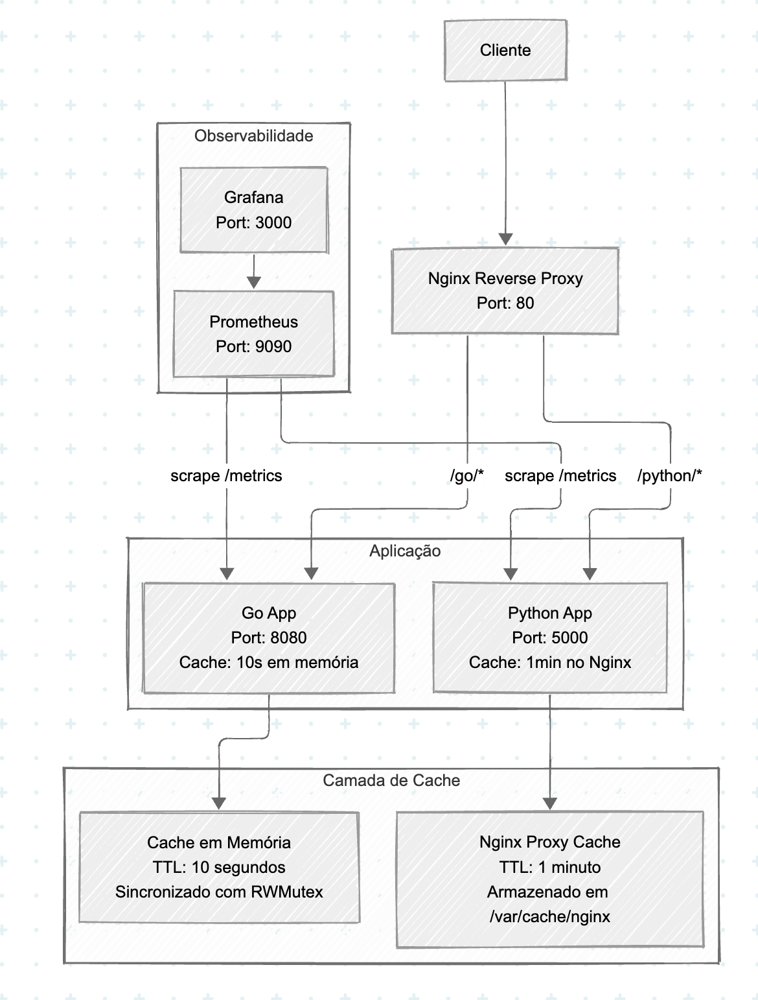
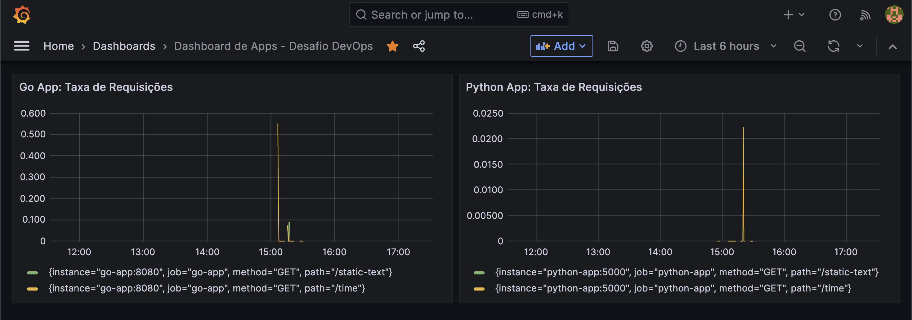
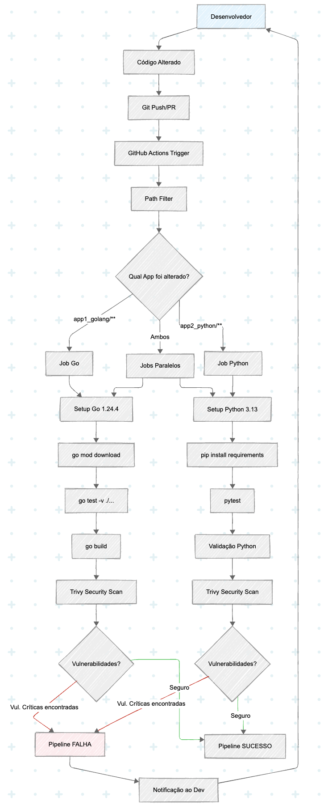

# Desafio DevOps - João Gabriel Lima Marinho
[](https://www.docker.com/)
[](https://golang.org/)
[](https://www.python.org/)
[](https://nginx.org/)
[](https://prometheus.io/)
[](https://grafana.com/)
[](https://redis.io/)

Este repositório contém a implementação completa de um desafio DevOps com duas aplicações em linguagens diferentes, camadas de cache, observabilidade e infraestrutura automatizada.

## 🔀 Implementações Disponíveis

### Implementação Principal (Branch Main)

- **Go**: Cache em memória interno
- **Python**: Nginx Proxy Cache

### Implementação Alternativa (Branch Redis)

- **Go**: Cache em memória interno
- **Python**: Redis Cache

🔗 **[Ver implementação com Redis](https://github.com/JoaoGabriel-Lima/desafio-devops/tree/feat/redis?tab=readme-ov-file)**

## 📋 Objetivo do Desafio

Criar uma infraestrutura robusta com:

- Duas aplicações em linguagens diferentes (Go e Python)
- Camadas de cache com tempos de expiração distintos
- Observabilidade (Prometheus e Grafana)
- Facilidade de execução (Docker Compose)

## 🏗️ Arquitetura da Solução



## 🚀 Como Executar

### Pré-requisitos

- Docker
- Docker Compose

### Execução

```bash
# Clone o repositório
git clone https://github.com/JoaoGabriel-Lima/desafio-devops.git
cd desafio_devops

# Iniciar toda a infraestrutura
docker-compose up -d

# Verificar status dos containers
docker-compose ps

# Visualizar logs
docker-compose logs -f
```

### Parar a aplicação

```bash
docker-compose down
```

## 🌐 Endpoints Disponíveis

### Aplicação Go (via Nginx)

- **GET** `http://localhost/go/` - Página inicial da aplicação Go
- **GET** `http://localhost/go/static-text` - Texto fixo (cache em memória: 10s)
- **GET** `http://localhost/go/time` - Horário atual do servidor (cache em memória: 10s)
- **GET** `http://localhost/go/metrics` - Métricas do Prometheus

### Aplicação Python (via Nginx)

- **GET** `http://localhost/python/` - Página inicial da aplicação Python
- **GET** `http://localhost/python/static-text` - Texto fixo (cache Nginx: 1min)
- **GET** `http://localhost/python/time` - Horário atual do servidor (cache Nginx: 1min)
- **GET** `http://localhost/python/metrics` - Métricas do Prometheus

### Observabilidade

- **Prometheus**: `http://localhost:9090`
- **Grafana**: `http://localhost:3000` (admin/admin)

## 🔧 Configuração das Camadas de Cache

### 1. Cache em Memória (Aplicação Go)

**Implementação**: Cache interno sincronizado com `sync.RWMutex`

**Configuração**:

```go
type CacheEmMemoria struct {
    sync.RWMutex
    items map[string]cacheItem
}

type cacheItem struct {
    valor      string
    expiracao  int64
}

const DEFAULT_CACHE_TTL = 10 * time.Second
```

**Características**:

- TTL: 10 segundos
- Thread-safe com RWMutex
- Expiração automática baseada em timestamp
- Cleanup automático no método Get()

### 2. Nginx Proxy Cache (Aplicação Python)

**Configuração no nginx.conf**:

```nginx
proxy_cache_path /var/cache/nginx keys_zone=my_cache:2m inactive=2m max_size=4m;

location /python/ {
    proxy_cache my_cache;
    proxy_cache_valid 200 1m;
    proxy_cache_key "$scheme$request_method$host$request_uri";
    add_header X-Cache-Status $upstream_cache_status;
    
    proxy_pass http://python-app:5000;
}
```

**Características**:

- TTL: 1 minuto para respostas 200
- Zona de cache: 2MB para chaves
- Cache máximo: 4MB
- Inatividade: 2 minutos
- Header `X-Cache-Status` para debug

### 3. Cache Redis (Implementação Alternativa)

**Implementação**: Cache distribuído usando Redis como armazenamento externo

**Configuração**:

```python
import redis

redis_client = Redis(host=os.environ.get('REDIS_HOST', 'localhost'), port=6379)
DEFAULT_TTL = 60  # Tempo de expiração padrão para cache em segundos

def static_text():
    cache_key = "texto_estatico"
    
    cached_text = redis_client.get(cache_key)
    if cached_text:
        print(f"CACHE HIT (Python): texto estático encontrado no cache Redis, tempo restante: {redis_client.ttl(cache_key)}")
        return Response(cached_text.decode('utf-8'), mimetype='text/plain')
    
    print("CACHE MISS (Python): texto estático não encontrado no cache Redis")
    redis_client.set(cache_key, "Texto estático (Python)", ex=DEFAULT_TTL)
    return Response("Texto estático (Python)", mimetype='text/plain')
```

**Características**:

- TTL: 1 minuto (60 segundos)
- Cache distribuído e persistente
- Suporte a expiraçãoautomática com comando `EXPIRE`
- Monitoramento de TTL com comando `TTL`
- Logs detalhados de CACHE HIT/MISS
- Configuração via variável de ambiente `REDIS_HOST`

## 📊 Observabilidade

### Métricas Coletadas

Ambas as aplicações expõem métricas com Prometheus:

**Contador de Requisições HTTP**:

```prometheus
http_total_requests{path="/", method="GET"}
```

### Dashboard Grafana



- **Go App**: Taxa de requisições por minuto
- **Python App**: Taxa de requisições por minuto
- Configuração automática via provisioning

## 🗂️ Estrutura do Projeto

```text
desafio_devops/
├── .github/
│   └── workflows/
│       └── ci.yml                  # Pipeline CI para Go e Python
├── .gitignore                      
├── docker-compose.yml              # Orquestração da infraestrutura
├── README.md                       
├── assets/
│   ├── dash_grafana.png           
│   └── infra_arq.png              
├── app1_golang/                    # App 1 (Standard Go Project Layout)
│   ├── Dockerfile
│   ├── go.mod
│   ├── go.sum
│   ├── cmd/app/main.go
│   └── internal/
│       ├── cache/
│       │   ├── cache.go           # Implementação do cache em memória
│       │   └── cache_test.go      # Testes unitários do cache
│       └── server/
│           └── server.go          # Funções das Rotas HTTP
├── app2_python/                    # App 2 (Python)
│   ├── Dockerfile
│   ├── requirements.txt
│   ├── app.py                     # App 2 (Python) com métricas
│   └── test_app.py                # Testes unitários do app Python
├── nginx/                          # Reverse proxy e cache
│   ├── Dockerfile
│   └── nginx.conf                  # Configuração com proxy cache
├── prometheus/                     # Monitoramento
│   └── prometheus.yml
└── grafana/                        # Visualização das métricas
    ├── dashboards/main-dashboard.json
    └── provisioning/
        ├── dashboards/provider.yml
        └── datasources/prometheus.yml
```

## 🔄 Fluxo de Atualização de Componentes

Foi implementado um fluxo de atualização de código que automatiza o processo de testes para os microsserviços. Uma pipeline foi feita para lidar com cenários onde temos alterações em qualquer uma das aplicações (Go ou Python), acionando a pipeline de CI.

### Processo de Atualização

#### 1. Desenvolvimento Local

- Desenvolvedor identifica um bug ou implementa nova feature
- Realiza alterações no código da aplicação Go (`app1_golang/`) ou Python (`app2_python/`)
- Executa testes localmente para validação inicial

#### 2. Versionamento e Trigger da Pipeline

- Commit das alterações com mensagem descritiva
- Push para branch `main` ou criação de Pull Request
- Pipeline CI é automaticamente acionada via GitHub Actions

#### 3. Detecção Inteligente de Mudanças

- Utiliza `dorny/paths-filter@v3` para detectar quais aplicações foram modificadas
- Executa jobs específicos apenas para as aplicações alteradas:
  - Se mudanças em `app1_golang/**` → executa job `teste-e-build-go`
  - Se mudanças em `app2_python/**` → executa job `teste-e-build-python`

#### 4. Validação Automatizada

- **Testes Unitários**: Executados automaticamente para garantir qualidade
  - Go: `go test -v ./...`
  - Python: `pytest`
- **Análise de Segurança**: Trivy identifica vulnerabilidades críticas
- **Build**: Compilação/validação da aplicação

#### 5. Falha e Recuperação

- Pipeline falha se testes não passarem ou vulnerabilidades críticas forem encontradas
- Desenvolvedor recebe notificação automática
- Correções podem ser feitas e pipeline re-executada

### 📊 Diagrama do Fluxo de Atualização



### 🛠️ Configuração da Pipeline

A pipeline está configurada no arquivo `.github/workflows/ci.yml` e inclui:

- **Triggers**: Push para `main` e Pull Requests
- **Path Filtering**: Execução condicional baseada nos arquivos alterados
- **Paralelização**: Jobs independentes para Go e Python
- **Security First**: Análise de vulnerabilidades com exit code 1 para críticas
- **Feedback Rápido**: Notificações imediatas em caso de falha

## 🚀 Pontos de Melhoria

### Melhorias do Aplicativo Go

A implementação atual de cache em memória é funcional, mas em um cenário de carga alta de requisições, ela apresentaria problemas de consumo de memória e performance

#### Melhoria 1.1: Limpeza Periódica de Itens Expirados

- Problema: Atualmente, um item que expirou só é removido do mapa quando uma nova requisição para a mesma chave acontece. Se uma chave expirar e nunca mais for acessada, ela fica na memória para sempre, causando um vazamento de memória lento e contínuo.
- Solução: Implementar uma rotina em background (uma goroutine) que, de tempo em tempo, "varre" a cache e remove os itens que já expiraram.

#### Melhoria 1.2: Implementação de Cache Distribuído

- Problema: O cache em memória é limitado ao processo atual e não pode ser compartilhado entre múltiplas instâncias da aplicação. Isso significa que cada instância terá seu próprio cache, causandoinconsistências e desperdício de memória.
- Solução: Implementar um cache distribuído (Redis ou Memcached), permitindo escalabilidade horizontal.

#### Melhoria 1.3: Limitação de Tamanho do Cache

- Problema: O cache em memória não tem limite de tamanho, o que pode levar a um consumo excessivo de memória se muitas chaves forem armazenadas, como por exemplo em um caso de expansão do app, onde novos endpoints são adicionados.
- Solução: Limitar o tamanho da cache e implementar uma política de substituição, como LRU (Least Recently Used), para garantir que o consumo de memória permaneça sob controle.

### Melhorias do Aplicativo Python

#### Melhoria 2.1: Prevenção de problemas de concorrência

- Problema: O cache Nginx é configurado para armazenar respostas, mas não há controle sobre concorrência. Se múltiplas requisições chegarem ao mesmo tempo, podem ocorrer problemas de concorrência, como múltiplas requisições tentando escrever no cache ao mesmo tempo.
- Solução: Implementar um mecanismo de bloqueio (lock) no Nginx para garantir que apenas uma requisição possa escrever no cache ao mesmo tempo.

#### Melhoria 2.2: Mostrar conteúdo expirado em casos de falha

- Problema: Se a aplicação Python cair ou começar a retornar erros (500, 502, 504), o Nginx repassará esses erros para o usuário
- Solução: Configurar o Nginx para retornar o conteúdo expirado do cache em caso de falha na aplicação Python.

### Melhorias de Infraestrutura

#### Melhoria 3.1: Monitoramento de Performance

- Problema: Atualmente, as métricas coletadas são básicas e não fornecem insights detalhados sobre a performance das aplicações.
- Solução: Implementar métricas adicionais, como latência de requisições, taxa de erro, além da relação de HIT/MISS da cache para ambas as aplicações, configurando o Prometheus para coletar essas métricas e o Grafana para visualizá-las, além de alertas para anomalias.

#### Melhoria 3.2: Escalabilidade Horizontal

- Problema: A infraestrutura atual não suporta escalabilidade horizontal de forma eficiente, especialmente para a aplicação Go.
- Solução: Implementar um balanceador de carga (como Traefik) para distribuir requisições entre múltiplas instâncias da aplicação Go, além de configurar o cache distribuído para que todas as instâncias compartilhem o mesmo cache.

#### Melhoria 3.3: Implementação de um pipeline de CD

- Problema: A infraestrutura atual não possui um pipeline de Continuous Deployment (CD) para automatizar o deploy das aplicações.
- Solução: Implementar um pipeline de CD que automatize o deploy das aplicações Go e Python, utilizando ferramentas como ArgoCD ou FluxCD para gerenciar o estado desejado da infraestrutura ou conectando diretamente ao servidor utilizando scripts de deploy.

#### Melhoria 3.4: Evolução do Docker Compose para um orquestrador de contêineres

- Problema: O Docker Compose é excelente para ambientes de um único nó, mas não oferece funcionalidades avançadas de escalabilidade, auto-recuperação e gestão de rede complexa.
- Solução: Para um cenário de produção real com alta disponibilidade, migrar a infraestrutura para um orquestrador de contêineres como Kubernetes ou Docker Swarm, que oferece recursos avançados como auto-escalabilidade, balanceamento de carga e recuperação automática de falhas.

## 🧪 Testes

### Testando Cache do Go (10 segundos)

```bash
# Primeira requisição (CACHE MISS)
curl http://localhost/go/time

# Segunda requisição imediata (CACHE HIT)
curl http://localhost/go/time

# Aguardar 10 segundos e fazer nova requisição (CACHE MISS)
sleep 11
curl http://localhost/go/time
```

### Testando Cache do Nginx (1 minuto)

```bash
# Primeira requisição (CACHE MISS)
curl -H "X-Cache-Status: debug" http://localhost/python/time

# Segunda requisição imediata (CACHE HIT)
curl -H "X-Cache-Status: debug" http://localhost/python/time

# Verificar status do cache no header
curl -I http://localhost/python/time
```

### Validando Métricas

```bash
# Métricas da aplicação Go
curl http://localhost/go/metrics

# Métricas da aplicação Python
curl http://localhost/python/metrics

# Verificar Prometheus
open http://localhost:9090

# Verificar Grafana
open http://localhost:3000
```

## 📝 Notas Técnicas

- **Go**: Utiliza goroutines para concorrência e RWMutex para thread-safety
- **Python**: Flask com Werkzeug middleware para métricas
- **Nginx**: Configurado como reverse proxy com cache layer
- **Prometheus**: Scraping automático das métricas das aplicações
- **Grafana**: Dashboards provisionados automaticamente
